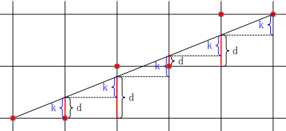

# Bresenham

Bresenham算法是用来描绘由两点所决定的直线的算法，它会计算出一条线段在位图上最接近的点。这个算法只会用到较为快速的整数加法、减法和位元移位，常用于绘制电脑画面中的直线。

## 样例

### 直线：$y=0.2x+10$

$d$表示当$x$方向取整数值时$y$方向的取值与上个$y$整数点的距离，所以当$d>0.5$时，直线与$y+1$更近，否则与$y$更近，即：

$\left\{\begin{align}
x_{i+1}&=x_i+1\\
y_{i+1}&=\left\{\begin{aligned}
&y_i+1&&d>0.5\\
&y_i&&d\leq0.5
\end{aligned}\right.
\end{align}\right.$

* $d_{初}=0$
* 每走一步：$d=d+k$
* 如果$d>0.5$，则$d=d-1$

如果将$d$全部减少$0.5$，则只需判断$d$的正负即可，即：

* $d_{初}=-0.5$
* 每走一步：$d=d+k$
* 如果$d>0$，则$d=d-1$

又因为假设$0\leq k\leq1$，所以$\Delta x$必为正，将所有的$d$全部乘上$2\Delta x$，不会影响对$d$符号的判断，得到：

* $d_{初}=-\Delta x$
* 每走一步：$d=d+2\Delta y$
* 如果$d>0$，则$d=d-2\Delta x$

此时该计算过程中只用到了整数加减法及移位操作，优化掉了浮点操作，比直接求$x$对应的$y$值然后判断接近的整数点效率提高很多。

### 圆：$x^2+y^2=50^2$

圆形只需要考虑$y=x$上方与$y$轴之间的$\frac{1}{8}$圆弧即可，其它部分可通过对称变换得到。在这部分里，当$x$增一时，$y$需要判断减一还是减零。设$F(x)=x^2+y^2-R^2$，当前点为$(x_0,y_0)$，则需要判断

$d_i=F(x_0+1,y_0-0.5)=(x_0+1)^2+(y_0-0.5)^2-R^2$

若$d_i\leq0$，下一点为$(x_0+1,y_0)$；

若$d_i>0$，下一点为$(x_0+1,y_0-1)$。

* 当$d\leq0$时：

  $\begin{align}
  d_{i+1}&=F(x_i+2,y_i-0.5)\\
  &=(x_i+2)^2+(y_i-0.5)^2-R^2\\
  &=(x_i+1)^2+(y_i-0.5)^2-R^2+2x_i+3\\
  &=d_i+2x_i+3
  \end{align}$

* 当$d_i>0$时：

  $\begin{align}
  d_{i+1}&=F(x_i+2,y_i-1.5)\\
  &=(x_i+2)^2+(y_i-1.5)^2-R^2\\
  &=(x_i+1)^2+(y_i-0.5)^2-R^2+(2x_i+3)+(-2y_i+2)\\
  &=d_i+2(x_i-y_i)+5
  \end{align}$

* 初始点为$(0,R)$，所以$d$的初始值为：

  $\begin{align}
  d_0&=F(1,R-0.5)\\
  &=1+(R-0.5)^2-R^2\\
  &=1.25-R
  \end{align}$

为了消去浮点运算，可以将所有的$d$全部乘上4，在不影响$d$的正负情况下，算法得到了进一步优化，即：

* $d_{初}=5-4R$
* 每走一步，如果$d\geq0$，则$d=d+8(x_i-y_i)+20$，同时$y=y-1$；否则$d=d+8x_i+12$。

### 椭圆：$\frac{x^2}{50^2}+\frac{y^2}{20^2}=1$

根据椭圆的对称性，只需要绘制出椭圆在第一象限的$\frac{1}{4}$即可。圆弧的不同部分，增量最大的方向不同，所以要以圆弧上斜率为$-1$的点作为分隔，将圆弧分为两个部分。对椭圆方程$\frac{x^2}{a^2}+\frac{y^2}{b^2}=1$求导得$\frac{dy}{dx}=-\frac{b^2x}{a^2y}$，即椭圆上一点$(x,y)$处斜率为$k=-\frac{b^2x}{a^2y}$。

* 当斜率$-1\leq k<0$时，即$b^2x\leq a^2y$，函数在$x$轴方向上增量较大，所以在这部分里，当$x$增一时，$y$需要判断减一还是减零。设$F(x)=b^2x^2+a^2y^2-a^2b^2$，当前点为$(x_0,y_0)$，则需要判断

  $d_i=F(x_0+1,y_0-0.5)=b^2(x_0+1)^2+a^2(y_0-0.5)^2-a^2b^2$

  若$d_i\leq0$，下一点为$(x_0+1,y_0)$；

  若$d_i>0$，下一点为$(x_0+1,y_0-1)$。

  * 当$d_i\leq0$时：

    $\begin{align}
    d_{i+1}&=F(x_i+2,y_i-0.5)\\
    &=b^2(x_i+2)^2+a^2(y_i-0.5)^2-a^2b^2\\
    &=b^2(x_i+1)^2+a^2(y_i-0.5)^2-a^2b^2+b^2(2x_i+3)\\
    &=d_i+b^2(2x_i+3)
    \end{align}$

  * 当$d_i>0$时：

    $\begin{align}
    d_{i+1}&=F(x_i+2,y_i-1.5)\\
    &=b^2(x_i+2)^2+a^2(y_i-1.5)^2-a^2b^2\\
    &=b^2(x_i+1)^2+a^2(y_i-0.5)^2-a^2b^2+b^2(2x_i+3)+a^2(2-2y_i)\\
    &=d_i+b^2(2x_i+3)+a^2(2-2y_i)
    \end{align}$

  * 初始点为$(0,b)$，所以$d$的初始值为：

    $\begin{align}
    d_0&=F(1,b-0.5)\\
    &=b^2+a^2(b-0.5)^2-a^2b^2\\
    &=b^2+a^2(0.25-b)
    \end{align}$

* 当斜率$k<-1$时，即$b^2x>a^2y$，函数在$y$轴方向上增量较大，所以在这部分里，当$y$减一时，需要判断$x$加一还是加零。设$F(x)=b^2x^2+a^2y^2-a^2b^2$，当前点为$(x_0,y_0)$，则需要判断

  $d_i=F(x_0+0.5,y_0-1)=b^2(x_0+0.5)^2+a^2(y_0-1)^2-a^2b^2$

  若$d_i>0$，下一点为$(x_0,y_0-1)$；

  若$d_i\leq0$，下一点为$(x_0+1,y_0-1)$。

  * 当$d_i>0$时：

    $\begin{align}
    d_{i+1}&=F(x_i+0.5,y_i-2)\\
    &=b^2(x_i+0.5)^2+a^2(y_i-2)^2-a^2b^2\\
    &=b^2(x_i+0.5)^2+a^2(y_i-1)^2-a^2b^2+a^2(3-2y_i)\\
    &=d_i+a^2(3-2y_i)
    \end{align}$

  * 当$d_i\leq0$时：

    $\begin{align}
    d_{i+1}&=F(x_i+1.5,y_i-2)\\
    &=b^2(x_i+1.5)^2+a^2(y_i-2)^2-a^2b^2\\
    &=b^2(x_i+0.5)^2+a^2(y_i-1)^2-a^2b^2+b^2(2x_i+2)+a^2(3-2y_i)\\
    &=d_i+b^2(2x_i+2)+a^2(3-2y_i)
    \end{align}$

  * 初始点为上一段中的最后一个点$(x,y)$，所以这部分$d$的初始值为：

    $\begin{align}
    d_0&=F(x+0.5,y-1)\\
    &=b^2(x+0.5)^2+a^2(y-1)^2-a^2b^2
    \end{align}$

### 抛物线：$y=\frac{x^2}{16}$

这里选取了较为简单的抛物线$y=\frac{x^2}{a}$，参数$a$主要用于放大图像。根据抛物线的对称性，只需要绘制出其在第一象限的$\frac{1}{2}$即可。对抛物线方程求导得$\frac{dy}{dx}=-\frac{2x}{a}$，即抛物线上一点$(x,y)$处斜率为$k=\frac{2x}{a}$，与$1$的大小关系不确定，也存在不同的最大增量方向，需要分类进行讨论。

* 当斜率$0< k<1$时，即$2x<a$，函数在$x$轴方向上增量较大，所以在这部分里，当$x$增一时，$y$需要判断加一还是加零。设$F(x)=y-\frac{x^2}{a}$，当前点为$(x_0,y_0)$，则需要判断

  $d_i=F(x_0+1,y_0+0.5)=(y_0+0.5)-\frac{(x_0+1)^2}{a}$

  若$d_i\leq0$，下一点为$(x_0+1,y_0+1)$；

  若$d_i>0$，下一点为$(x_0+1,y_0)$。

  * 当$d_i\leq0$时：

    $\begin{align}
    d_{i+1}&=F(x_i+2,y_i+1.5)\\
    &=(y_i+1.5)-\frac{(x_i+2)^2}{a}\\
    &=(y_i+0.5)-\frac{(x_i+1)^2}{a}-\frac{2x_i+3}{a}+1\\
    &=d_i-\frac{2x_i+3}{a}+1
    \end{align}$

  * 当$d_i>0$时：

    $\begin{align}
    d_{i+1}&=F(x_i+2,y_i+0.5)\\
    &=(y_i+0.5)-\frac{(x_i+2)^2}{a}\\
    &=(y_i+0.5)-\frac{(x_i+1)^2}{a}-\frac{2x_i+3}{a}\\
    &=d_i-\frac{2x_i+3}{a}
    \end{align}$

  * 初始点为$(0,0)$，所以$d$的初始值为：

    $\begin{align}
    d_0&=F(1,0.5)\\
    &=0.5-\frac{1}{a}
    \end{align}$
    
  * 可以将所有的$d$全部乘上$a$，在不影响$d$的正负情况下，去掉了算法中的除法运算以减小误差，即：

    * $d_{初}=0.5a-1$
    
    * 每走一步，如果$d\geq0$，则$d=d-(2x_i+3)+a$，同时$y=y+1$；否则$d=d-(2x_i+3)$。

* 当斜率$k\geq1$时，即$2x\geq a$，函数在$y$轴方向上增量较大，所以在这部分里，当$y$加一时，需要判断$x$加一还是加零。设$F(x)=b^2x^2+a^2y^2-a^2b^2$，当前点为$(x_0,y_0)$，则需要判断

  $d_i=F(x_0+0.5,y_0+1)=(y_0+1)-\frac{(x_0+0.5)^2}{a}$

  若$d_i>0$，下一点为$(x_0+1,y_0+1)$；

  若$d_i\leq0$，下一点为$(x_0,y_0+1)$。

  * 当$d_i>0$时：

    $\begin{align}
    d_{i+1}&=F(x_i+1.5,y_i+2)\\
    &=(y_i+2)-\frac{(x_i+1.5)^2}{a}\\
    &=(y_i+1)-\frac{(x_i+0.5)^2}{a}-\frac{2(x_i+1)}{a}+1\\
    &=d_i-\frac{2(x_i+1)}{a}+1
    \end{align}$

  * 当$d_i\leq0$时：

    $\begin{align}
    d_{i+1}&=F(x_i+0.5,y_i+2)\\
    &=(y_i+2)-\frac{(x_i+0.5)^2}{a}\\
    &=(y_i+1)-\frac{(x_i+0.5)^2}{a}+1\\
    &=d_i+1
    \end{align}$

  * 初始点为上一段中的最后一个点$(x,y)$，所以这部分$d$的初始值为：

    $\begin{align}
    d_0&=F(x+0.5,y+1)\\
    &=(y+1)-\frac{(x+0.5)^2}{a}
    \end{align}$
    
  * 跟随上一段，将所有的$d$全部乘上$a$，即：

    * $d_{初}=a(y+1)-(x+0.5)^2$
    
    * 每走一步，如果$d>0$，则$d=d-2(x_i+1)+a$，同时$x=x+1$；否则$d=d+a$。

### 正弦波：$y=16sin(\frac{x}{16})$

选取的正弦波的函数表达式为$y=asin(\frac{x}{a})$，参数$a$主要用于放大图像。根据正弦波的对称性，只需要绘制出其在第一象限的$\frac{1}{4}$周期即可，但是正弦波的对称轴与$\pi$有关，对称变换涉及浮点数运算，这时候使用对称变换在位图上画正弦波会有不可避免的误差产生，随着对称次数的增多，与真实函数图像的偏移也会越来越大，所以我这里仅使用$y$轴作为对称轴，绘制$y$轴右侧的所有图像，避免累计误差导致的图像不准确。

对抛物线方程求导得$\frac{dy}{dx}=cos(x)$，即抛物线上一点$(x,y)$处斜率为$k=cos(x)$，在上升段$0<k<1$，在下降段$-1<k<0$，最大增量方向都是$x$轴方向，但下一点$y$的取值方向不同，需要分类进行讨论。

* 当处于上升段时，即$-\frac{\pi}{2}+2k\pi<x<\frac{\pi}{2}+2k\pi$，当$x$增一时，$y$需要判断加一还是加零。设$F(x)=y-asin(\frac{x}{a})$，当前点为$(x_0,y_0)$，则需要判断

  $d_i=F(x_0+1,y_0+0.5)=(y_0+0.5)-asin(\frac{x_0}{a})$

  若$d_i\leq0$，下一点为$(x_0+1,y_0+1)$；

  若$d_i>0$，下一点为$(x_0+1,y_0)$。

  * 当$d_i\leq0$时：

    $\begin{align}
    d_{i+1}&=F(x_i+2,y_i+1.5)\\
    &=(y_i+1.5)-asin(\frac{x_i+2}{a})\\
    &=(y_i+0.5)-asin(\frac{x_i+1}{a})+asin(\frac{x_i+1}{a})-asin(\frac{x_i+2}{a})+1\\
    &=d_i+asin(\frac{x_i+1}{a})-asin(\frac{x_i+2}{a})+1
    \end{align}$

  * 当$d_i>0$时：

    $\begin{align}
    d_{i+1}&=F(x_i+2,y_i+0.5)\\
    &=(y_i+0.5)-asin(\frac{x_i+2}{a})\\
    &=(y_i+0.5)-asin(\frac{x_i+1}{a})+asin(\frac{x_i+1}{a})-asin(\frac{x_i+2}{a})\\
    &=d_i+asin(\frac{x_i+1}{a})-asin(\frac{x_i+2}{a})
    \end{align}$

  * 初始点为$(x,y)$，所以$d$的初始值为：

    $\begin{align}
    d_0&=F(x+1,y+0.5)\\
    &=y+0.5-asin(\frac{x+1}{a})
    \end{align}$

* 当处于下降段时，即$\frac{\pi}{2}+2k\pi<x<\frac{3\pi}{2}+2k\pi$，当$x$增一时，$y$需要判断减一还是减零。设$F(x)=y-asin(\frac{x}{a})$，当前点为$(x_0,y_0)$，则需要判断

  $d_i=F(x_0+1,y_0-0.5)=(y_0-0.5)-asin(\frac{x_0}{a})$

  若$d_i\leq0$，下一点为$(x_0+1,y_0)$；

  若$d_i>0$，下一点为$(x_0+1,y_0-1)$。

  * 当$d_i\leq0$时：

    $\begin{align}
    d_{i+1}&=F(x_i+2,y_i-0.5)\\
    &=(y_i-0.5)-asin(\frac{x_i+2}{a})\\
    &=(y_i-0.5)-asin(\frac{x_i+1}{a})+asin(\frac{x_i+1}{a})-asin(\frac{x_i+2}{a})\\
    &=d_i+asin(\frac{x_i+1}{a})-asin(\frac{x_i+2}{a})
    \end{align}$

  * 当$d_i>0$时：

    $\begin{align}
    d_{i+1}&=F(x_i+2,y_i-1.5)\\
    &=(y_i-1.5)-asin(\frac{x_i+2}{a})\\
    &=(y_i-0.5)-asin(\frac{x_i+1}{a})+asin(\frac{x_i+1}{a})-asin(\frac{x_i+2}{a})-1\\
    &=d_i+asin(\frac{x_i+1}{a})-asin(\frac{x_i+2}{a})-1
    \end{align}$

  * 初始点为$(x,y)$，所以$d$的初始值为：

    $\begin{align}
    d_0&=F(x+1,y+0.5)\\
    &=y-0.5-asin(\frac{x+1}{a})
    \end{align}$
* 对于$sin()$函数，没有找到较好的转换为整数的方法，所以在这里使用Bresenham算法并不能提高绘图的效率，相反，由于计算$sin()$的次数变多了，绘图速度还会慢于直接根据$x$值求$y$值，然后找最接近整数像素点的传统方法。

## 测试结果
|函数类型|测试函数|直接计算耗时|算法优化耗时|性能提升|
|:---:|:---:|:---:|:---:|:---:|
|直线|$y=0.2x+10$|$0.032ms$|$0.025ms$|√|
|圆|$x^2+y^2=50^2$|$0.018ms$|$0.017ms$|√|
|椭圆|$\frac{x^2}{50^2}+\frac{y^2}{20^2}=1$|$0.015ms$|$0.013ms$|√|
|抛物线|$y=\frac{x^2}{16}$|$0.029ms$|$0.026ms$|√|
|正弦波|$y=16sin(\frac{x}{16})$|$0.032ms$|$0.037ms$|×|

计算耗时的方法是每次重复绘制$1000$次，取$1000$次的中位数，然后多次重复，当记录下的中位数不再发生变化时，将其作为平均耗时。之所以不使用平均数，是因为平均数波动太大，只有当每次重复绘制达到$100000$次时，平均数才能趋于稳定，因此使用中位数来作为绘图耗费时间的标准。

其中圆形只有$\frac{1}{8}$圆弧进行计算，其它部分都由对称得出，因此使用算法优化与直接计算耗时相差不大，但多次测量后平均耗时确实低于直接计算，如果圆的半径加大，优势会更加明显。绘制正弦波的耗时则因为算法优化并没有减少浮点运算次数，反而增加了时间消耗。其它各函数优化效果较为明显，绘制直线时没有利用对称变换，性能提升最为明显。